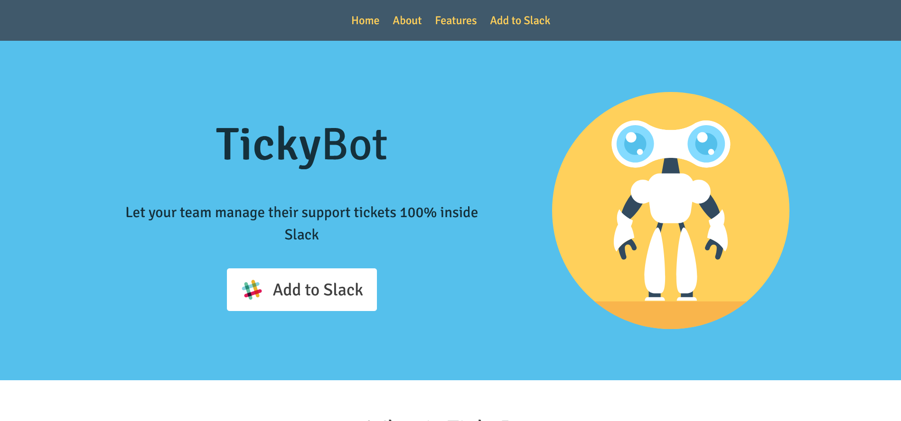

# Chingu Solo Project - Tier 1 - Tickybot Clone

## Overview

Live Site: [TickyBot Clone](https://helenclx.github.io/TickyBot-Clone/)

This is a clone of the [TickyBot web page](https://maknetaro.github.io/tickyBot/) using HTML, CSS and vanilla JavaScript, built as a [solo project](https://github.com/chingu-voyages/soloproject-tier1-tickybot-clone) for [Chingu](https://www.chingu.io/).

## Features

This project includes:
- Responsive, mobile-friendly layout
- Smooth scroll to top button
- Accessible web design
- Mobile-first design workflow

## Running the Project

From the repository:
1. Clone this project locally
1. Open `index.html` using your browser
1. Check out the wen page's functionality

## Dependencies

- Google Fonts: [Signika](https://fonts.google.com/specimen/Signika)